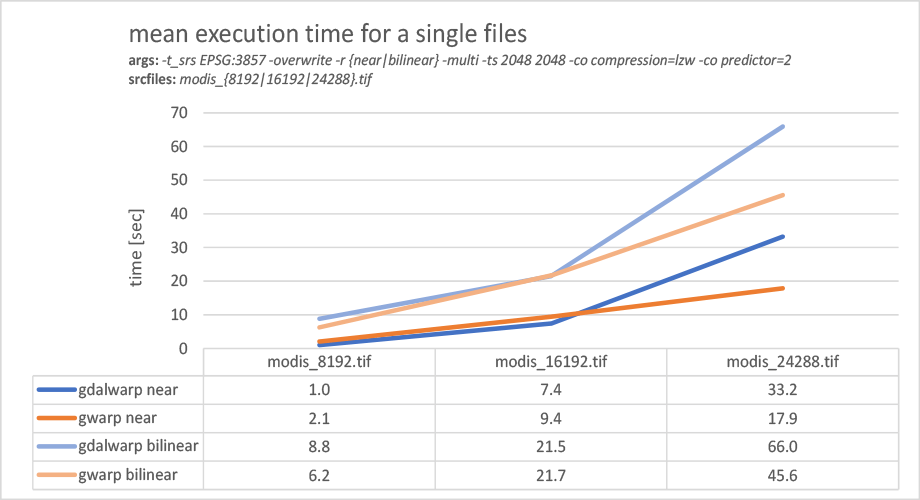

=====
gwarp
=====

gdalwarp batch processor (vips accelerated)

Requirements
===========
- gdal (with bindings)
- vips (with bindings)
- numpy

Install
===========

.. code::

  pip install git+https://github.com/indus/gwarp.git

Options
===========
**gwarp** provides a subset of the familiar `gdalwarp options <https://gdal.org/programs/gdalwarp.html>`_ :

.. code::

  gwarp -t_srs EPSG:3857 -overwrite -r bilinear -multi -ts 1024 1024 -co compress=lzw <src> <dst>

... as well as some additional (mostly vips related) options. For more info:

.. code:: 
  
  gwarp -h

Description
===========

**gwarp** uses `gdalwarp <https://gdal.org/python/osgeo.gdal-module.html#Warp>`_ to first apply the desired projection and transformation to a single index file (lookup table). This index is then applied in a loop to all src files in the glop pattern using `vips <https://libvips.github.io/libvips/API/current/libvips-resample.html#vips-mapim>`_. The output files can be written either in place with a suffix or to a separate folder.
When multiple files all need to be warped the same way, the persistence of the index results in a proportional performance gain. As the benchmarks show, **gwarp** can also lead to a speedup in the processing of a single very large input file. Since the exact reasons for this are not yet known and since the overhead of python compared to C++ also includes the chance of a performance degradation, the use cases should be examined carefully.
 
**gwarp** works best when using the GeoTiff format for input and output. However, all other formats supported by vips (JPEG, PNG, WebP, etc.) can also be written. But in this case the geo information will be lost.

For the resampling method 'nearest' gwarp can produce output identical to gdalwarp. For all the other supported methods there may be minor differences in the output. **gwarp** has a mapping to choose the most appropriate interpolator in the vips stage based on the resampling method of gdalwarp (can be chosen explicitly as well).

Special care should be taken in the presence of NoData values. **gwarp** has options to set "srcnodata" and "dstnodata" explicitly, but these are not well tested and may produce output different from gdalwarp.

Benchmark
===========
| **system:** *CPU: i7-6700 CPU @ 3.40GHz, 4 cores; MEM: 64GB; OS: Win 10*
| **GDAL:** *3.2.2, released 2021/03/05*
| **gwarp:** *0.1, released 2021/05/26*

single file [`details <https://github.com/indus/gwarp/blob/main/tests/bench.bat#L16-L18>`_]
----

multiple files [`details <https://github.com/indus/gwarp/blob/main/tests/bench.bat#L20-L22>`_]
----

